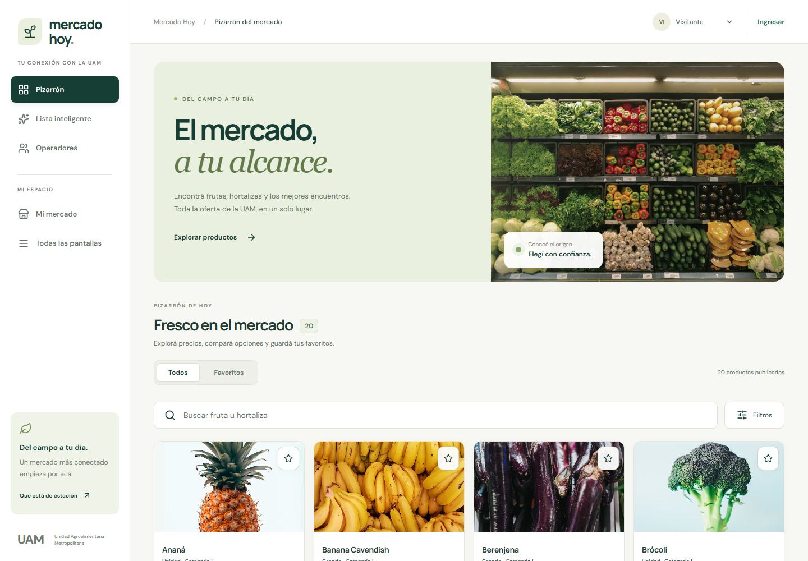
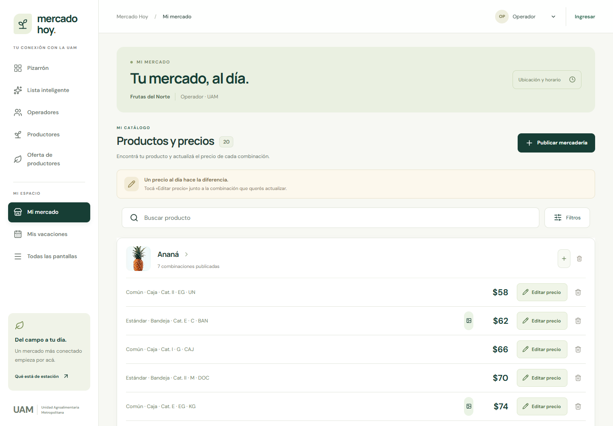
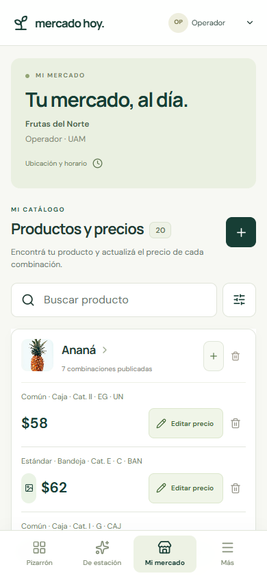
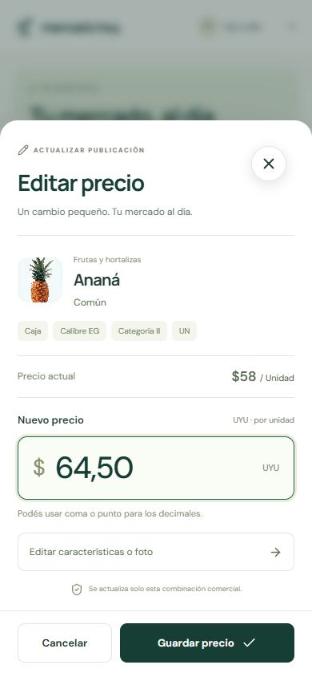

# Design iterations

## 7 — UAM PDF replaces local smart-list recommendations

Replaced the public recommendation list with a button opening the configured UAM PDF in a new tab. The sidebar and mobile seasonal shortcuts use the same link; the existing `/lista-inteligente` route remains available with the button. Administration now contains only a PDF URL field, save action and current-document link. The initial URL is the September 2026 PDF supplied by the user.

The link is stored under `proto-test:uam-smart-list-pdf` in localStorage, survives reloads and updates other tabs on the same origin. This frontend prototype does not synchronize the setting across devices or enforce production admin authorization. Invalid URLs and failed writes retain the previous link and show an error.

Verified production build and 6 browser tests, including persisted updates, cross-tab refresh, external navigation, validation, storage failure, and all 24 original routes at mobile/desktop widths. Reviewed `docs/smart-list-link-admin.png` and `docs/smart-list-link-public.png`. No pending UI tasks; server-backed configuration is outside this prototype's current scope.

## 6 — Separate price entry from combination editing

Tapping the amount now opens a centered white dialog containing only a title, selected whole-peso input, Confirmar and Cancelar. Removed the product summary, commercial attributes, current-price comparison, helper copy and details link from this dialog. The pencil directly opens the full commercial-combination form. Cancellation immediately discards the draft.

The dialog follows the visual viewport to stay centered in the space above a mobile keyboard, with large input and action targets. Verified centered layout, automatic input focus, separate pencil behavior, saves and cancellations for both roles across V1/V2/V3. Production build and all 19 browser tests passed. Captures: `docs/price-only-mobile.png`, `docs/price-only-keyboard-space.png`, `docs/price-only-desktop.png`. The short viewport simulates reduced space; physical mobile keyboard behavior was not tested. Pending tasks: none.

## 5 — Shared palette and white page background

Applied the supplied cream, gray, lime, green, dark green and charcoal palette across the three stylesheets, with shared definitions in `src/palette.css`. The subsequent background sample was measured as `#FFFFFF` and applied to the page background. Retained semantic red for errors and the previously requested delete controls. Kept the 15px commercial descriptions, layouts and interactions unchanged.

Verified the production build, all 24 routes at mobile/desktop widths, short-viewport forms, and filters (4 browser tests). Inspected desktop, mobile and slider screenshots in `docs/palette-*.png` and verified all three variants use the requested palette and white page background. Used white lettering on green buttons and dark green for small accent text to improve contrast. No pending tasks; all edits remain inside `Proto-Test`.

## 1 — New interface and focused price editing

**Finding:** Editing a price previously opened the entire commercial-combination form. The price input came after catalog attributes and the optional photo. Navigation to seller tools required finding screens in a general prototype menu.

**Changes:** Built a new navigation shell, public-market layout, and seller workspace. Added a shared focused price editor for operators and producers, keeping all original catalog attributes and existing grouping. Added decimal-comma handling, sticky actions, clear save feedback, and an unsaved-price discard choice. Kept the full combination editor accessible from the price sheet.

**Feedback:** Routine edits became easier to find. The first visual pass still put too much seller information before the products on phones. Old baseline styles also added unwanted button wrapping and empty space inside market cards.

## 2 — Mobile density and interaction checks

**Changes:** Moved seller location and hours into an expandable section; corrected action sizing and excess card spacing. Reduced secondary text and made publishing a compact, labeled-for-accessibility add button on phones. Preserved all commercial rows instead of hiding combinations. Fixed keyboard bubbling from nested favorite actions and added focus containment/restoration to the shared drawer.

**Feedback:** At 390 × 844, the first two combination prices are now visible immediately. The operator and producer share the same interaction and validation behavior. A save changes the selected price, preserves neighboring rows and all attributes, and returns to the same scroll position.

## 3 — Compatibility and final verification

**Checks:**

- TypeScript and production build passed.
- Four unit tests passed: unchanged domain-helper source, valid/invalid decimal input, commercial-attribute preservation, and species grouping with publication identities.
- Nine browser tests passed across the final verification runs. These include both seller roles, search/favorites, dependent filters, publication creation, full-editor handoff, cancel/discard, focus containment, and a short 390 × 430 viewport.
- All 24 tested original routes rendered at 390px and 1440px without page-level JavaScript exceptions or horizontal overflow.
- The seller view was checked for overflow at 320, 360, 390, 768, and 1024px.
- Visual previews were captured in `docs/`.

**Limits:** Browser checks used headless Microsoft Edge with resized viewports. A resized short viewport checks available space but does not substitute for testing a physical iOS/Android keyboard, touch gestures, or screen reader. The original prototype's simulated authentication, generated data, and in-memory persistence remain unchanged.

**Pending implementation tasks:** None for this prototype iteration. Physical-device usability feedback can inform a later iteration.

## Previews

## 5 — Catalog controls and administrator price increment

**Changes:** Naves use A, B, C and E in fixtures and selectors. Navigation says “Lista inteligente”. The catalog action reads “Agregar Producto”, and each species card has “Agregar [especie]”; both use the available width on mobile without clipping. Group, species, minimum price and maximum price stay visible; additional filters remain collapsible. Price bounds filter the actual commercial rows, including manual edits, and public board price intervals use range overlap.

**Administration:** “Ajuste de precios” opens the same centered amount editor as manual price editing, with Cancelar and Confirmar. A positive integer defines both + and −, initially $10. The value persists in this browser and synchronizes its open tabs; this prototype does not provide server persistence or cross-device synchronization.

**Verification:** Production build and 5 catalog/input tests passed. The 21 existing browser checks and 3 new checks passed, covering both roles, all UI variants, dependent filters, actual combination prices, administrator validation/persistence/cancellation, species preselection, and uncropped add buttons at 320–1440px. Reviewed mobile and desktop screenshots and the centered administrator editor in headless Edge.

**Pending tasks:** None for this requested iteration. Changes are confined to `Proto-Test`; no commit or push was made.

## 4 — Compact cards and whole-peso price controls

**Changes:** Applied the requested batches to the shared operator/producer cards. V2 now orders controls as minus, editable price, plus, photo. Step buttons use dark green with white symbols; pencil and delete controls share compact dimensions, with muted red for deletion. Commercial labels occupy the full card width, and mobile rows are approximately 66px tall (70px in V3).

**Editing:** Tapping the amount opens manual editing in every variant. V3 groups the amount and a separate slider action inside one fitted border. Inputs accept positive whole pesos; existing fractional display values are rounded, and trailing decimal zeros are hidden. Catalog/domain helpers remain unchanged. Slider gestures move by $1 with a minimum of $1, and retain keyboard and double-tap support.

**Slider:** Removed the version heading, current-price comparison and repeated gesture instructions; simplified the ruler, background and heading.

**Verification:** Production build, 5 unit tests and 19 browser tests passed. Checks cover both roles, manual editing in every variant, photo placement, full-width labels, compact rows, step increments, touch dragging, save/discard, focus, unchanged sibling rows, original routes, and widths from 320px to 1440px. Reviewed new screenshots in `docs/ui-*.png`. Browser verification uses headless Edge; no physical-device test was performed.

**Pending tasks:** None for the three requested batches. Changes remain inside `Proto-Test`; no commit was created.

### Earlier previews

